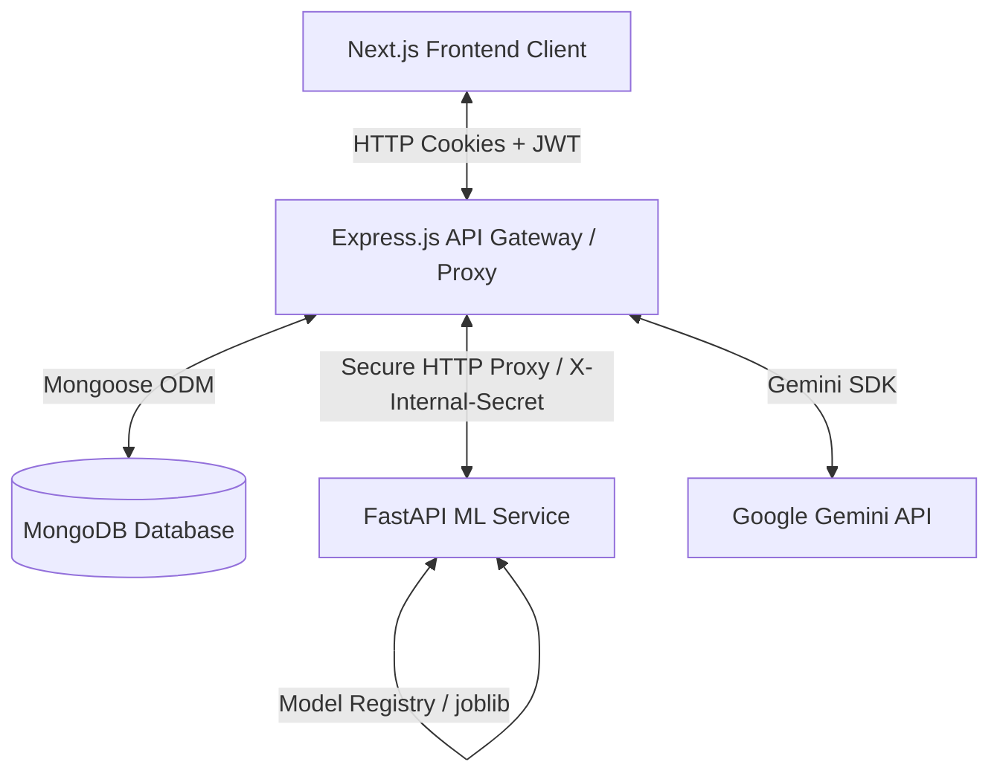

# HireMate AI — Premium AI SaaS Suite
> A premium, dark-themed AI-powered platform for interview preparation, resume optimization, and career roadmapping. Built for modern tech job-seekers and software engineers.

---

## ❶ Project Overview

### What is HireMate AI?
HireMate AI is a comprehensive, production-ready SaaS application designed to help job-seekers, students, and tech professionals land their dream roles. It bridges the gap between generic preparation and target-company requirements by providing automated, highly calibrated evaluations.

### Why was it built?
Traditional resume screening (ATS) and interview processes are notoriously opaque. Candidates often submit hundreds of resumes without receiving feedback or enter interviews without realistic practice. HireMate AI was built to bring visibility and feedback loops directly to the candidate's workspace.

### What problem does it solve?
1. **ATS Black Box:** Calibrates resumes using NLP skill extraction and machine learning regressors to predict ATS compatibility score before applying.
2. **Generic Mock Interviews:** Simulates realistic company-specific behavioral, technical, and coding interview environments with real-time feedback.
3. **Static Skill Progression:** Generates dynamic learning roadmaps that adapt to a candidate's specific skill gap for a target role.

---

## ❷ Key Features

### 📄 Resume Builder & Optimizer
*   **Structured Resume Builder:** Multi-step wizard supporting real-time workspace preview and dynamic rendering.
*   **Doc Ingestion & Parsing:** Instantly parses existing `.pdf` and `.docx` (Word) resumes utilizing `pdf-parse` and `mammoth`.
*   **ATS Calibration Regressor:** Uses a Random Forest Regressor microservice to compute an ATS score (0–100) based on textual content and power-verb checks.
*   **Natural Language Skill Extraction:** Normalizes and extracts key technical and tool competencies using NLTK (Natural Language Toolkit).
*   **Role-Based Skill Gap Audit:** Analyzes the candidate's competencies against target industry roles (e.g., Frontend, DevOps, Data Analyst) and highlights missing tags.

### 🎭 Mock Interview Console
*   **Multi-Mode Simulation:** Supports three interactive mock interview types:
    1.  **Chat Mode:** Interactive typing interface with context-aware AI interviewers.
    2.  **Voice Mode:** Real-time speech-to-text transcript processing with a pulsing mic visual orb indicating state.
    3.  **Coding Mode:** 3-pane integrated development environment (IDE) utilizing Monaco Editor, test-case verification, and inline AI tutoring.
*   **Post-Interview Analytics HUD:** Delivers granular scorecards, performance radar charts, and question-by-question AI reviews.

### 🗺️ Career Roadmap Generator
*   **Dynamic Milestones:** Generates vertical timelines outlining expected milestones, required skills, and duration boundaries.
*   **Learning Recommendations:** Automatically suggestions courses, articles, and documentation links filtered by tech stack.

---

## ❸ Tech Stack

| Domain | Technologies Used |
|---|---|
| **Frontend** | Next.js 16 (App Router), React 19, TypeScript, Tailwind CSS v4, Framer Motion, Zustand |
| **Backend / Gateway** | Node.js, Express, Passport.js (OAuth 2.0), JWT Sessions |
| **Database** | MongoDB Atlas, Mongoose ODM |
| **AI / ML Services** | FastAPI (Python), Scikit-Learn, Pandas, NumPy, NLTK, MLflow |
| **APIs / SDKs** | Google `@google/genai` (Gemini SDK), Monaco Editor API |
| **Libraries** | Puppeteer (PDF Export), Multer (File Handling), pdf-parse, mammoth |
| **Dev Tools** | nodemon, ts-node, ESLint, PostCSS |

---

## ❹ System Architecture

HireMate AI utilizes a decoupled, secure microservices pattern. All public traffic routes through the Express.js Gateway, which enforces authentication and acts as a secure proxy to the FastAPI Python service.



1.  **Next.js 16 Client:** Renders the monochrome interface. Interacts with the backend via secure cookies.
2.  **Express Gateway:** Handles route protection, input sanitization, file uploads, social OAuth handshakes, and database persistence.
3.  **FastAPI Python Service:** Dedicated machine learning environment executing scikit-learn regressors, TF-IDF vector matching, and Matplotlib chart exports.

---

## ❺ Folder Structure

```
HireMate/
├── frontend/               # Next.js 16 Client Application
│   ├── public/             # Static assets, fonts, and icons
│   └── src/
│       └── app/            # App Router pages and features
│           ├── auth/       # Authentication page
│           ├── profile/    # User profile and skills configuration
│           ├── resume-*/   # Resume builder and optimizer screens
│           └── interview/  # Mock interview setups and live pages
├── backend/                # Express.js Server & API Gateway
│   ├── src/
│   │   ├── config/         # MongoDB and Passport configurations
│   │   ├── middleware/     # JWT authentication and CORS policies
│   │   ├── models/         # MongoDB Schemas (User, Session, Resume)
│   │   ├── routes/         # REST endpoints proxying to FastAPI
│   │   └── services/       # File parsing and Puppeteer exports
└── ml-service/             # Python FastAPI Machine Learning microservice
    ├── models/saved/       # Serialized Random Forest models (.joblib)
    ├── app.py              # Main FastAPI app and controllers
    ├── config.py           # Tech skills taxonomy and mapping configs
    ├── job_matcher.py      # TF-IDF Cosine Similarity logic
    ├── resume_scorer.py    # Random Forest Regressor and MLflow setup
    └── skill_analyzer.py   # NLTK tokenization and keyword extractor
```

---

## ❻ Installation & Setup

### Prerequisites
*   Node.js (v18+ recommended)
*   Python (3.9 - 3.11 recommended)
*   MongoDB Instance (Local or Atlas)

### Step 1: Clone the Repository
```bash
git clone https://github.com/JHON-WICK-007/hiremate.git
cd hiremate
```

### Step 2: Configure the Backend & DB
1. Navigate to the backend folder:
   ```bash
   cd backend
   npm install
   ```
2. Create a `.env` file in the `backend/` directory following the [Environment Variables](#-environment-variables) section below.
3. Start the Express server:
   ```bash
   npm run dev
   ```

### Step 3: Configure the ML Microservice
1. Navigate to the ml-service folder:
   ```bash
   cd ../ml-service
   ```
2. Create a virtual environment and activate it:
   ```bash
   python -m venv venv
   # On Windows:
   .\venv\Scripts\activate
   # On macOS/Linux:
   source venv/bin/activate
   ```
3. Install Python dependencies:
   ```bash
   pip install -r requirements.txt
   ```
4. Start the FastAPI microservice on Port 8000:
   ```bash
   python -m uvicorn app:app --reload --port 8000
   ```
   *(Note: The ML service trains a default model automatically on startup if one isn't found in `models/saved/`)*

### Step 4: Configure the Frontend
1. Navigate to the frontend folder:
   ```bash
   cd ../frontend
   npm install
   ```
2. Start the Next.js development server:
   ```bash
   npm run dev
   ```
3. Open [http://localhost:3000](http://localhost:3000) in your browser.

---

## ❼ Environment Variables

### Backend Gateway Config (`backend/.env`)
Create this file in the `backend/` root directory:

```env
# MongoDB Connection
MONGO_URI=your_mongodb_connection_string

# Server Config
PORT=5000
NODE_ENV=development

# JWT Session Secrets
JWT_SECRET=your_jwt_signing_secret_key
JWT_EXPIRES_IN=7d

# CORS Handling (URL of Next.js frontend)
CLIENT_URL=http://localhost:3000

# ML Microservice Location
ML_SERVICE_URL=http://localhost:8000

# AI Core Integration (Google AI Studio Key)
GEMINI_API_KEY=your_gemini_api_key

# Passport Social Login Credentials
GOOGLE_CLIENT_ID=your_google_oauth_client_id
GOOGLE_CLIENT_SECRET=your_google_oauth_client_secret
```

---

## ❽ Usage Guide

1.  **Account Registration:** Sign up or authenticate via Google OAuth.
2.  **Profile Configurations:** Navigate to the **Profile** dashboard. Configure your details, add existing skill chips, and select your target professional role (e.g., *Frontend Developer*).
3.  **Resume Optimization:**
    *   Navigate to **Resume Optimizer**, upload a `.pdf` or `.docx` resume.
    *   Review your generated ATS Calibration Score, read the NLTK skill checks, and examine your missing keywords.
4.  **Mock Interview Session:**
    *   Navigate to **Interview Console**, select your target company and role.
    *   Select your mode: **Chat**, **Voice** (real-time stream), or **Coding** (interactive Monaco Editor).
    *   Complete the session, review feedback scorecards, and check the performance radar graphs on the **Dashboard**.

---

## ❾ Security Features

*   **Zero-Trust Validation:** Input shapes validated using Zod on the API gateway and parsed via Pydantic model schemas on the ML service.
*   **Secure Session Cookies:** JWT tokens stored inside `HttpOnly`, `Secure`, `SameSite=Strict` cookies.
*   **Path Traversal Prevention:** Uploaded resumes renamed with UUIDs upon disk write to prevent directory manipulation.
*   **SSRF Puppeteer Defense:** Puppeteer runs restricted sandboxed processes denying access to loopback ranges and local cloud metadata endpoints.
*   **Next.js Server Actions Protection:** Authentication and schema authorization checks are verified at the entry boundary of Server Actions.
*   **Internal Service Isolation:** FastAPI microservice is shielded behind Express gateway, validating HMAC/secret token signatures for all cross-service proxy calls.

---

## ❿ Performance Optimizations

*   **Model Caching:** Serialized Random Forest parameters are loaded once during FastAPI lifespan startup to eliminate model initialization latency.
*   **Code Splitting & Lazy Components:** Heavy pages (e.g., Monaco Code Editor and post-interview charts) are lazily loaded.
*   **Vector Comparisons:** Uses vectorized calculations (`numpy` arrays and Cosine Similarity) to resolve similarity queries in milliseconds.
*   **Asset Management:** Dynamic vector graphics used exclusively. External Unsplash visuals use optimized Next.js Image patterns.

---

## 11 Error Handling

*   **Gateway Error Filtering:** Production mode hides stack traces and database schema diagnostics, returning unified safe error strings.
*   **Exceptions Lifecycle:**
    *   *Validation Failures (400):* Returns explicit validation warnings.
    *   *Auth Expirations (401):* Clears cookies and automatically re-routes clients to the `/auth` interface.
    *   *Network Resiliency:* API failures are caught gracefully with user-facing Toast alerts.

---

## 12 Future Enhancements

*   **Code Sandbox Integration:** Dockerized running container engine (e.g., Judge0 Integration) to execute user submissions in a secure virtualized environment.
*   **WebRTC Voice Streaming:** Implement native WebRTC audio pipelines for lower voice-mode interaction latency.
*   **LinkedIn Parser integration:** Directly fetch profile content to fill builder forms.

---

## 13 Project Info & Versioning

*   **Project Status:** In Active Development (Beta)
*   **Current Version:** 2.5.0
*   **License:** MIT License
*   **Author:** JHON-WICK-007
*   **Known Limitations:** Real-time code execution in Coding mode currently runs mockup verification. Full sandboxed execution is slated for future release.