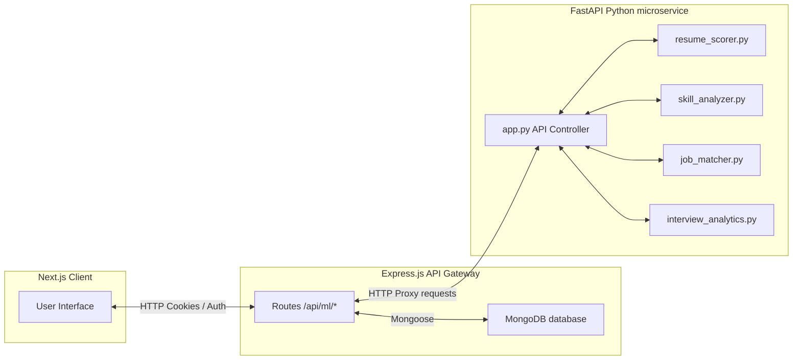

# HireMate AI — Machine Learning Service Overview

This document provides a comprehensive developer-focused overview of the **Python Machine Learning microservice** in HireMate AI. It details what the service does, how it works, how it integrates with the rest of the application, and its API specifications.

---

## 1. What the ML Service Can Do (Current Capabilities)

The ML service is built as a separate high-performance Python microservice using **FastAPI** to handle heavy data calculations, NLP parsing, and predictive modeling tasks.

### 📊 A. Resume Scoring (Random Forest Regressor)
- **Feature Engineering:** Extracts structured numerical metrics from plain resume text, including:
  - Text statistics (word count, sentence count, average sentence length, unique word ratio).
  - Essential sections check (contact info, email, phone, links, experience, education).
  - Actions/Power verbs count (e.g., *built*, *optimized*, *architected*, *deployed*).
  - Quantifiable metrics (numbers, metrics, percentages).
  - Skill coverage metrics.
- **Model Architecture:** Passes the engineered feature vector into a trained **RandomForestRegressor** model (via `scikit-learn`) which yields a calibrated score (0–100) indicating how professional and ATS-compliant the resume is.
- **Lifespan Startup Hook:** Trains a baseline model automatically on startup if one doesn't exist, utilizing synthetic datasets of 500 samples to establish realistic weights.
- **MLflow Tracking:** Logs parameters, metrics (Mean Absolute Error, $R^2$ Score), and serializes the trained model (`.joblib`) into the model registry URI.

### 🧠 B. Natural Language Skill Extraction
- **Text Analysis:** Normalizes and parses resume text using **NLTK (Natural Language Toolkit)**.
- **Pattern Matching:** Matches tokens against a comprehensive dictionary of technical skills (languages, libraries, frameworks, cloud engines, database models, utilities).
- **Output:** Returns a deduplicated array of extracted technical competencies and total counts.

### 🎯 C. Role-Based Skill Gap Analysis
- **Core Logic:** Accepts the candidate's resume text and their target professional role (e.g., *Frontend Developer*, *DevOps Engineer*, *Data Analyst*).
- **Audit Comparison:** Compares extracted resume skills against defined keyword prerequisites for the target role.
- **Output:** Returns:
  - **Matched Skills:** Skills present in both the resume and the target role criteria.
  - **Missing Skills:** Highly sought-after skills for that role that the candidate is missing.
  - **Gap Score:** A calculated compatibility percentage representing their readiness.

### 🔍 D. Job Matching & Batch Matching
- **Vector Search:** Converts the resume text and job description(s) into **TF-IDF (Term Frequency-Inverse Document Frequency) vectors**.
- **Cosine Similarity:** Computes the cosine angle between vectors using `scikit-learn` to calculate a matching ratio representing context similarity.
- **Batch Processing:** Allows matching a single resume against a list of $N$ job postings, returning a sorted list of matches ranked by highest similarity scores.

### 📈 E. Interview Performance Analytics
- **Aggregation:** Ingests raw interview history records from MongoDB.
- **Data Engineering:** Uses **Pandas** and **NumPy** to calculate average candidate scores across specific evaluation vectors (Technical Accuracy, Communication, Confidence, Relevance, Problem Solving).
- **Visualization:** Generates professional metrics diagrams (radar/bar charts) using **Matplotlib** and **Seaborn**.
- **Output:** Returns stats along with the generated chart images serialized as base64-encoded PNG strings for inline rendering on the frontend.

---

## 2. System Architecture & Integration

HireMate AI uses a microservice-based setup. Here is how the systems communicate:



### Proxy Communication
Instead of exposing the python service directly to the public web (which runs on port `8000`), the **Express.js API Gateway** acts as a reverse proxy:
1. Client requests an Express endpoint (e.g., `POST /api/ml/resume-score`) with a JWT.
2. Express validates the authentication token (`protect` middleware).
3. Express forwards the payload to the ML service using a built-in Node.js `http` client proxy helper.
4. FastAPI processes the calculations and returns the JSON payload back through the gateway.

---

## 3. FastAPI API Endpoints Reference

The python service exposes the following JSON endpoints on port `8000`:

### 1. `GET /health`
- **Description:** Verifies service uptime and dependency libraries readiness.
- **Response:**
  ```json
  {
    "status": "ok",
    "service": "HireMate ML Service",
    "version": "1.0.0",
    "libraries": { "scikit-learn": true, "pandas": true, "numpy": true, "mlflow": true }
  }
  ```

### 2. `POST /api/ml/resume-score`
- **Description:** Scores a candidate's resume using the random forest model.
- **Request Body:** `{ "resume_text": "string" }`
- **Response:**
  ```json
  {
    "success": true,
    "data": {
      "score": 78.4,
      "features": { "word_count": 450, "skill_count": 12, "action_verb_count": 8, "quantifiable_achievements": 3 }
    }
  }
  ```

### 3. `POST /api/ml/train-model`
- **Description:** Retrains the Random Forest classifier and tracks parameters & metrics via MLflow.
- **Request Body:** None
- **Response:**
  ```json
  {
    "success": true,
    "message": "Model trained successfully",
    "metrics": { "mae": 3.82, "r2_score": 0.89 }
  }
  ```

### 4. `POST /api/ml/extract-skills`
- **Description:** Parses technical keyword tokens from raw text.
- **Request Body:** `{ "resume_text": "string" }`
- **Response:**
  ```json
  {
    "success": true,
    "data": {
      "skills": ["Python", "FastAPI", "React", "Docker", "MongoDB"],
      "count": 5
    }
  }
  ```

### 5. `POST /api/ml/skill-gap`
- **Description:** Evaluates missing skills for a desired job title.
- **Request Body:** `{ "resume_text": "string", "target_role": "string" }`
- **Response:**
  ```json
  {
    "success": true,
    "data": {
      "target_role": "DevOps Engineer",
      "gap_score": 60.0,
      "matched_skills": ["Docker", "Git"],
      "missing_skills": ["Kubernetes", "Terraform", "CI/CD", "AWS"]
    }
  }
  ```

### 6. `POST /api/ml/job-match`
- **Description:** Ranks similarity of a resume to a job description.
- **Request Body:** `{ "resume_text": "string", "job_description": "string" }`
- **Response:**
  ```json
  {
    "success": true,
    "data": {
      "match_percentage": 72.5
    }
  }
  ```

### 7. `POST /api/ml/batch-job-match`
- **Description:** Ranks similarity of a resume against multiple job descriptions.
- **Request Body:**
  ```json
  {
    "resume_text": "string",
    "jobs": [
      { "id": "1", "title": "Developer", "description": "Looking for React dev..." },
      { "id": "2", "title": "Designer", "description": "Looking for Figma designer..." }
    ]
  }
  ```
- **Response:**
  ```json
  {
    "success": true,
    "data": [
      { "id": "1", "title": "Developer", "match_percentage": 82.4 },
      { "id": "2", "title": "Designer", "match_percentage": 14.2 }
    ]
  }
  ```

### 8. `POST /api/ml/interview-analytics`
- **Description:** Computes performance metrics and returns base64 charts.
- **Request Body:**
  ```json
  {
    "interviews": [
      {
        "category": "Behavioral",
        "scores": { "technical": 8, "communication": 9, "problem_solving": 7 }
      }
    ]
  }
  ```
- **Response:**
  ```json
  {
    "success": true,
    "data": {
      "average_overall": 8.0,
      "total_interviews": 1,
      "category_averages": { "technical": 8.0, "communication": 9.0, "problem_solving": 7.0 },
      "radar_chart_base64": "iVBORw0KGgoAAAANSUhEUgAA..."
    }
  }
  ```
